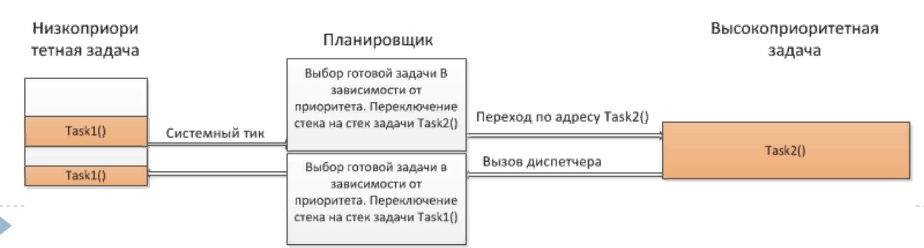

:figure-caption: Рисунок
:table-caption: Таблица
= Лабораторная работа №2 - Операционные системы реального времени (ОСВР)
:toc:
:toc-title: Оглавление:

Чепульская О.С., Яковенко А.Д. КЭ-413 +

=  *Введение* +

=== *ОСВР* +
*Операционные системы реального времени* (RTOS) - предназначены для обеспечения интерфейса к ресурсам критических по времени систем реального времени. +
*Временем реакции системы на события* - интервал времени (от возникновения запроса на прерывание и до выполнения первой инструкции обработчика) от события на объекте и до выполнения первой инструкции в программе обработки этого события. +

=== *Задачи ОСВР* +

*Основной задачей* в таких системах является своевременность (timeliness) выполнения
обработки данных. То есть *задачей ОСРВ* является обеспечение реакции на определенное действие за отведенный квант времени. +
Еще одной *задачей* ОСРВ является обеспечение *многозадачности* (или псевдомногозадачности - обеспечение мнимого видения одновременного исполнения нескольких операций) +

Существует две версии многозадачности:

* *Мягкого* реального времени(soft real time) - определяет предполагаемое время ответа, и если оно истекло, то ОС относит задачу к не отвечающим.
* *Жесткого* реального времени(hard real time) - каждая задача должна выполняться за отведенный квант времени, невыполнение данного условия ведет к краху всей системы.

Виды многозадачности:

* *Кооперативная* - следующая задача не выполнится, пока
полностью не завершена предыдущая (Не подходит для высоконагруженных систем)
* *Вытесняющая* - более высоко-приоритетная задача может
вытеснить менее приоритетную

=== *Сравнение ОСРВ и ОСОН* +

Таблица сравнения ОСРВ и обычных операционных систем:
|===
|    | ОС реального времени | ОС общего назначения

| Основная задача
| Успеть среагировать на события, происходящие на оборудовании	
| Оптимально распределить ресурсы компьютера между пользователями и задачами

| На что ориентирована		
| Обработка внешних событий
| Обработка действий пользователя

| Как позиционируется	
| Инструмент для создания конкретного аппаратно-программного комплекса реального времени	
| Воспринимается пользователем как набор приложений, готовых к использованию

| Кому предназначена		
|Квалифицированный разработчик
| Пользователь средней квалификации

|===

=== *Принцип работы*

Принцип работы запуска задач (представляет из себя бесконечный цикл) которые вызываются
планировщиком каждый раз по прерыванию системного таймера. Нужно чтобы системный таймер реагировал раз в несколько миллисекунд, чем меньше время тем меньше квант этого времени. +

Системная реакция таймера запускает *Планировщик задач*. Планировщик задач смотрит и отправляет наиболее приоритетные задачи на выполнение. Если есть задачи прирететнее текущей, то он её прерывает. По завершении задачи планировщик снова выбирает приоретеную, если более приоретеных задач нет, то он отправляет нашу текущую задачу. +

*Системный тик* обеспечивает прерывание каждую 1 мс. Системный тик
Один из таймеров микроконтроллера (в Cortex M4 для этого
отведен специальный системный таймер), настраивают на
генерацию системных тиков. Один тик делается, обычно, раз в
1 м с, но можно и чаще или реже. В зависимости от того какая
реакция и дискретность системы нам нужна.

.Схема работы

