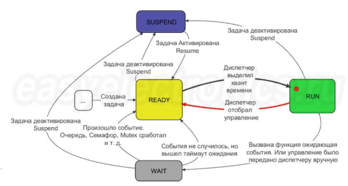

:figure-caption: Рисунок
:table-caption: Таблица
= Лабораторная работа №2 - Операционные системы реального времени (ОСВР)
:toc:
:toc-title: Оглавление:

Чепульская О.С., Яковенко А.Д. КЭ-413 +

=  *Введение* +

=== *ОСВР* +
*Операционные системы реального времени* (RTOS) - предназначены для обеспечения интерфейса к ресурсам критических по времени систем реального времени. +
*Временем реакции системы на события* - интервал времени (от возникновения запроса на прерывание и до выполнения первой инструкции обработчика) от события на объекте и до выполнения первой инструкции в программе обработки этого события. +

=== *Задачи ОСВР* +

*Основной задачей* в таких системах является своевременность (timeliness) выполнения
обработки данных. То есть *задачей ОСРВ* является обеспечение реакции на определенное действие за отведенный квант времени. +
Еще одной *задачей* ОСРВ является обеспечение *многозадачности* (или псевдомногозадачности - обеспечение мнимого видения одновременного исполнения нескольких операций) +

Существует две версии многозадачности:

* *Мягкого* реального времени(soft real time) - определяет предполагаемое время ответа, и если оно истекло, то ОС относит задачу к не отвечающим.
* *Жесткого* реального времени(hard real time) - каждая задача должна выполняться за отведенный квант времени, невыполнение данного условия ведет к краху всей системы.

Виды многозадачности:

* *Кооперативная* - следующая задача не выполнится, пока
полностью не завершена предыдущая (Не подходит для высоконагруженных систем)
* *Вытесняющая* - более высоко-приоритетная задача может
вытеснить менее приоритетную

=== *Сравнение ОСРВ и ОСОН* +

Таблица сравнения ОСРВ и обычных операционных систем:
|===
|    | ОС реального времени | ОС общего назначения

| Основная задача
| Успеть среагировать на события, происходящие на оборудовании	
| Оптимально распределить ресурсы компьютера между пользователями и задачами

| На что ориентирована		
| Обработка внешних событий
| Обработка действий пользователя

| Как позиционируется	
| Инструмент для создания конкретного аппаратно-программного комплекса реального времени	
| Воспринимается пользователем как набор приложений, готовых к использованию

| Кому предназначена		
|Квалифицированный разработчик
| Пользователь средней квалификации

|===

=== *Принцип работы*

Принцип работы запуска задач (представляет из себя бесконечный цикл) которые вызываются
планировщиком каждый раз по прерыванию системного таймера. Нужно чтобы системный таймер реагировал раз в несколько миллисекунд, чем меньше время тем меньше квант этого времени. +

Системная реакция таймера запускает *Планировщик задач*. Планировщик задач смотрит и отправляет наиболее приоритетные задачи на выполнение. Если есть задачи прирететнее текущей, то он её прерывает. По завершении задачи планировщик снова выбирает приоретеную, если более приоретеных задач нет, то он отправляет нашу текущую задачу. +

*Системный тик* обеспечивает прерывание каждую 1 мс. Системный тик
Один из таймеров микроконтроллера (в Cortex M4 для этого
отведен специальный системный таймер), настраивают на
генерацию системных тиков. Один тик делается, обычно, раз в
1 м с, но можно и чаще или реже. В зависимости от того какая
реакция и дискретность системы нам нужна. +
Каждый тик это вызов прерывания таймера, в котором
вызывается планировщик. Это время еще называют *квантом*,
говорят, что задаче выделяется квант времени.

.Схема работы
image::imlab2,1.PNG[600, 600]

=== *Задача*

*Задача* - это мини подпрограмма, которая имеет свою точку входу, и исполняется внутри бесконечного цикла и обычно не должна выходить из него.

* Имеет собственный стек.
* Имеет приоритет
* Может иметь название и идентификатор (номер)
 
Функции связанные с задачей с задачей:

* Задачу можно создать
* Задачу можно удалить
* Задачу можно оповестить
* Активировать/Деактивировать
* Перевести в режим ожидания

Изначально задача не инициализирована. Т.е. задачи как таковой нет, есть лишь некий
кусок кода, который лежит в памяти программ мы знаем его адрес и знаем, что это наша
задача. В этом случае она занимает только место в памяти программ. +
В нужный момент задача создается командой ( в FreeRTOS это xTaskCreate(…) )где в
длинном перечне аргументов мы передаем указатель на нашу задачу, ее приоритет, имя
для отладки и сколько мы под нее памяти выделяем. В результате под нее выделяется
кусок памяти, заводится свой стек и она запускается в свободную жизнь. В которой
может быть в нескольких состояниях:

* *READY* Задача запущена и готова принять на себя управление. 
* *RUN* T.е. диспетчер переключил управление на нее, процессор прогоняет непосредственно ее код через себя в данный момент.
* *WAIT* Задача в спячке. 
* *SUSPEND* Выключено.

Задачу можно удалить (в FreeRTOS командой vTaskDelete(…)).

.Схема работы Задачи

=== *FreeRTOS*
Бесплатная многозадачная операционная система
реального времени (ОСРВ) для встраиваемых
систем. Портирована на 35 микропроцессорных
архитектур. +

Планировщик системы очень маленький и простой,
однако можно задать
различные приоритеты процессов, вытесняющую и
невытесняющую многозадачность. Ядро системы умещается в 3
-4 файлах.

API функции управления задачами, кратко. Аргументы посмотрите в технической
документации. Список некоторых функций:

* *xTaskCreate* - создает новую задачу, выделяя под нее память и натравливая на нее диспетчер.
* *vTaskDelete* - удаляет задачу. Память потом освобождает IDLE задача.
* *vTaskDelay(N)* - эта функция вызывает диспетчер, который переводит задачу в WAIT на N системных тиков. Можно на ней лепить всякие простые задержки, вроде опроса кнопок.
* *vTaskDelayUntil(N)* - функция аналогичная предыдущей, но считает время Т не от момента ее срабатывания, а от момента прошлого пробуждения задачи.

= *Схема в StarUML*

Перед началом написания кода нам надо продумать архитектуру, которую мы будем воплащать. Для этого воспользуемся StarUML.

.Архитектура и взаимодействие класса в StarUML.
image::image.png[]

=  *Ход работы* +
Первым делом подключаем операционную систему, прописываем в main.cpp

[source, cpp]
#include "rtos.hpp"         // for Rtos для подключения OC

в самом rtos.hpp есть функция создания потока(задачи)

[source, cpp]
 __forceinline template<typename T >
    static void CreateThread(T& thread, const char *pName, ThreadPriority prior = ThreadPriority::normal)
    {
      return RtosWrapper::wCreateThread<Rtos>(thread, pName, prior, thread.stackDepth, thread.stack.data());
    }

А так же система запуска ОС

[source, cpp]
__forceinline static inline void Start()
    {
      RtosWrapper::wStart();
    }

Дальше нужно сделать задачу в нашем случае это класс. Каждый класс должен наследовать интерфейс Thread с различными функциями, к примеру Sleep и Signal. В нём нужно указать размер стека задач.

[source, cpp]
class MyTask : public OsWrapper::Thread<static_cast<std::size_t>(OsWrapper::StackDepth::minimal)> //  в шаблоне нужно указать размер стека для задачи, к примеру 200 байт.

Так же в каждой задача должен быть метод Execute, определяет то что делает наша задача.

[source, cpp]
#include "myfirsttask.h"
#include "gpiocregisters.hpp" // for GPIOC
void MyFirstTask:: Execute()
{
  for(;;)
  {
    GPIOC::ODR::Toggle(1 << 8);
    Sleep(1000ms);
  }
}

Мы создали обьект класса, а теперь его нужно зарегистрировать в ОС в main.cpp +
Прописываем вызов создания задачи, с выбранным приоритетом, и вызов запуска.

[source, cpp]
OsWrapper::Event event{500ms, 1};
OsWrapper::Event buttonEvent{500ms, 1}; // Событие для отправки. Вркмя ожидания отправки
ButtonTask buttonTask(buttonEvent) // Передаем информацию(ссылку)
MyFirstTask myFirstTask;
MySecondTask mySecondTask;
LedTask ledTask(ButtonEvent);
int main()
{
  using namespace OsWrapper;
  Rtos::CreateThread(myFirstTask, "myFirstTask", ThreadPriority::highest); // Задаем приоритет, в данном случае высокий
  Rtos::CreateThread(mySecondTask, "MySecondTask", ThreadPriority::highest);
  Rtos::CreateThread(buttonTask, "ButtonTask", ThreadPriority::normal); 
  Rtos::CreateThread(ledTask, "LedTask", ThreadPriority::normal);
  Rtos::Start(); // Вызов запуска ОС
  return 0;
}
