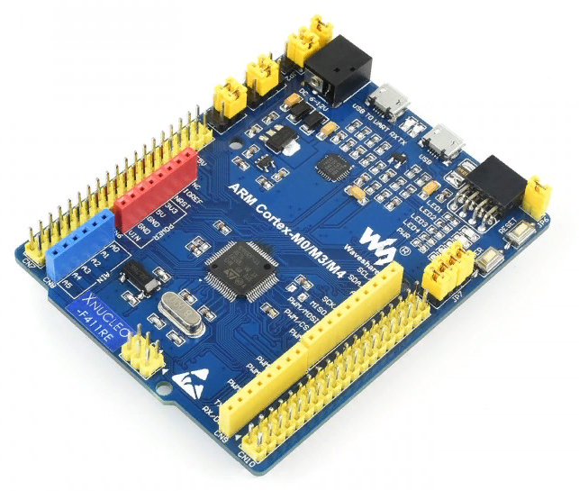
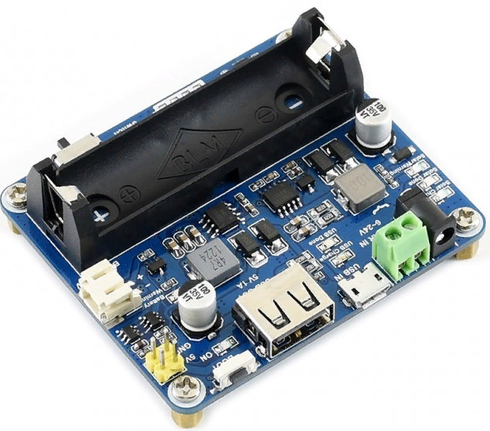
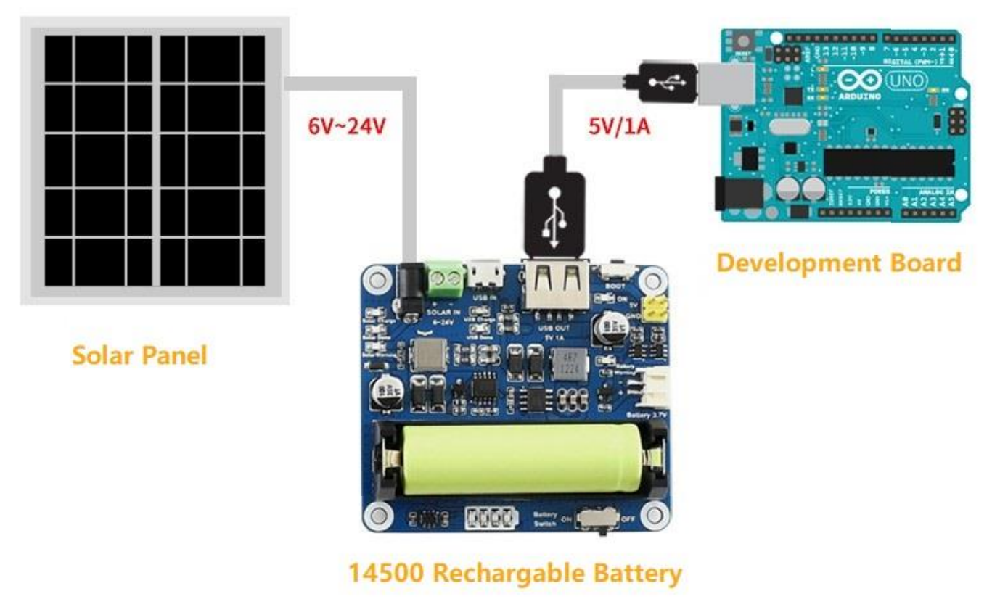

:figure-caption: Рисунок
:table-caption: Таблица
= Анализ требований к разработке
:toc:
:toc-title: Оглавление:

Тема работы: *Разработка метеостанции с передачей параметров по беспроводному интерфейсу*

Чепульская О.С., Яковенко А.Д. КЭ-413 +

= Для разработки должна использоваться отладочная плата XNUCLEO-F411RE

XNUCLEO-F411RE – это отладочная плата от компании Waveshare с поддержкой Arduino, которая позволит изучить возможности микроконтроллера STM32F411RET6 на базе ядра Cortex-M3.

.Вид платы XNUCLEO-F411RE.

= Питание платы должно быть автономным и подаваться с солнечный батарей

Питание будет подаваться с модуля управления солнечной энергией, для панели солнечных батарей 6V~24V. 
Этот модуль управления солнечной энергией может заряжать аккумуляторную литиевую батарею 3.7 V через солнечную панель или USB-соединение и обеспечивает регулируемый выход 5V/1A.

Характеристики:

* Напряжение солнечной панели (SOLAR IN): 6V ~ 24V;
* Зарядные устройства: Солнечная панель, адаптер питания, USB;
* USB-интерфейс зарядки: Micro USB: 5V/1A;
* Внутренняя литий-батарея: 3.7 V 14500 Li-battery;
* Входное напряжение USB: 5V (интерфейс Micro USB);
* Выход 5V: 5V / 1A (USB OUT, GPIO);
* Защита от напряжения отключения заряда: 4.2 V ± 1％;
* Напряжение защиты от перегрузки: 2.9V ± 1％;
* Эффективность заряда солнечной панели: 78%;
* Эффективность зарядки USB: 82%;
* Максимальный ток покоя: <2мА;
* Рабочая температура: -40℃ ~ 85℃.

.Модуль управления солнечной энергией

.Способ подключения солнечной батареи

= Программное обеспечение измерение должно измерять давление, влажность и температуру и рассчитывать точку росы

=== Период измерения должен быть 100 ms.

=== Для измерения давления, влажности и температуры должен использоваться датчик BME280

BME280 – высокоточный метеодатчик, измеряющий такие параметры микроклимата как температура, влажность и атмосферное давление. +
В зависимости от модуля может подключаться к I2C и SPI шинами микроконтроллера и работать от 3-5V, если на плате есть стабилизатор, или 3V, если его нет. +
Данный модуль работает по двухпроводному интерфейсу I2C, адрес по умолчанию 0x76, но есть возможность изменить на адрес 0x77. Модуль подключается на шину I2C и питание, как и любой другой модуль такого типа. +

Библиотеки:

* Adafruit BME280 (для работы также нужна Adafruit Sensor) – самая известная библиотека для работы с BME280. Часть настроек доступна только при ручном редактировании библиотеки.
* GyverBME280 –Также поддерживает датчики BMP280

=== Общение с датчиком должно осуществляться по интерфейсу SPIx (где х - любой не равный 1,2,3)

SPIx-это библиотека тестирования пользовательского интерфейса, которая позволяет управлять пользовательским интерфейсом вашего приложения Qt/QML либо с помощью кода c++, либо через интерфейс RPC.
SPI (Последовательный периферийный интерфейс) – это синхронный протокол передачи данных для сопряжения ведущего устройства (Master) с периферийными устройствами (Slave). Ведущим устройством часто является микроконтроллер.
Функции:
•	Отправка событий мыши (щелчок, перемещение, перетаскивание)
•	Удаление данных mime из внешних приложений
•	Введите текст
•	Проверьте наличие и видимость элементов
•	Получить значения свойств элементов (текст, позиция, цвет, ...)
•	Сделайте и сохраните снимок экрана
•	Выйти из приложения
Вы можете использовать Spix для непосредственного создания событий Qt из C++ в качестве модульного теста. Поскольку события Qt генерируются непосредственно внутри приложения и не поступают из системы, курсор мыши фактически не будет двигаться, а взаимодействие с другими приложениями ограничено. 
Существует четыре режима передачи данных (SPI_MODE0, SPI_MODE1, SPI_MODE2, SPI_MODE3), обусловленные сочетанием полярности тактовых импульсов (работаем по уровню HIGH или LOW), Clock Polarity, CPOL, и фазой тактовых импульсов (синхронизация по переднему или заднему фронту тактового импульса), Clock Phase, CPHA.

=== Точка росы должна считаться на основе текущих показаний влажности и давления

Точка росы под давлением [°Cтрд] - это температура, до которой сжатый воздух может быть охлажден без образования конденсата. Точка росы зависит от давления процесса. Когда давление падает, точка росы также снижается.
Говоря о системах под давлением, мы имеем в виду точку росы под давлением, но не атмосферную точку росы. 

= Передача значений по беспроводному интерфейсу должна осуществляться через модуль BlueTooth Bee HC-06

Беспроводной модуль для приема/передачи данных в Arduino проектах по протоколу Bluetooth.
Особенности:
- Поддерживает работу с любым USB Bluetooth адаптером;
- Скорость передачи данных: 9600 бит/сек;
- Встроенная антенна;
- Радиус действия до 10 метров.
- Питание 3,3В – 6 В;
- Скорость передачи данных 1200–1382400 бод;
- Рабочие частоты 2,40 ГГц – 2,48ГГц;
Модуль имеет следующие контакты:
•	VCC , GND – плюс и минус питания;
•	RX и TX – приемник и передатчик;
•	MCU-INT – выводит статус;
•	Clear (Reset) – сбрасывание и перезагрузка модуля. Последние два вывода обычно не задействованы в работе, поэтому сейчас производятся модули без этих контактов.
Модуль HC-06 используется только в режиме slave, то есть он не может самостоятельно подключаться к другим устройствам Bluetooth. Все настройки для подключения «пароль, скорость передачи данных» можно изменить при помощи АТ-команд.

=== Формат вывода:

"Давление: " XXX.XX [мм рт.ст.]
"Влажность: " XXX.XX [%]
"Температура: " XXX.XX [℃]
"Точка росы": " XXX.XX C"

=== Для подключения модуля BlueTooth должна использоваться плата Accessories Shield или I/O Expansion Shield

Accessory Shield - это плата расширения совместимая с популярными платформами для разработки электронных приложений, такими как Arduino UNO, Arduino Leonardo, NUCLEO, XNUCLEO и совместимыми.
Особенности:
- Разъем расширения для подключения плат Arduino;
- Разъем XBee для подключения беспроводных модулей;
- Индикатор состояния XBee;
- Индикатор питания;
- Кнопка сброса модулей XBee и Arduino;
IO Expansion Shield - это Arduino плата расширения для удобного подключения сенсоров и беспроводных модулей серии BEE.
Особенности:
- Интерфейс для подключения сенсоров 3-пин и 4-пин;
- Разъем XBee;
- Разъем для модуля WIFI-LPT100.
Установленные компоненты/интерфейсы на плате:
- Разъем для подключения модулей XBee;
- IIC интерфейс;
- SPI интерфейс;
- Сенсор интерфейс 3-пин (VCC, GND, digital pin);
- Разъем для подключения модуля WIFI-LPT100;
- Сенсор интерфейс 4-пин (VCC, GND, analog pin, digital pin);
- Джампер конфигурации VCC: 3.3В или 5В;
- Джампер выбора отладка/коммуникация;
- Индикаторы состояния XBee и WIFI-LPT100;
- Кнопки WIFI-LPT100 RELOAD, XBee и WIFI-LPT100 RESET, XBee EASYLINK.

=== Общение с платной модуля BlueTooth должна осуществляться через USART2

Режим встроенного загрузчика используется для программирования флэш-памяти с использованием интерфейса: USART2 (PD5/PD6)
В модуле USART можно настраивать следующие параметры:
•	Скорость обмена до 4 мбит/c
•	Контроль четности
•	1 или 2 стоповых битов
•	8 или 9 бит данных
•	Запросы на детектирование ошибок приемо-передачи
•	Прерывания по приему, передачи, ошибкам передачи
Для настройки и работы модуля UART нужны всего несколько регистров 
•	USART_CR1/CR2/CR3 - регистр настройки 1
•	USART_DR - регистр принятого символа (регистр данных)
•	USART_BRR – регистр настройки скорости передачи
•	USART_SR - регистр состояния

=== Период вывода информации через BlueTooth модуль должен быть 1 секунда.

= Архитектура должна быть представлена в виде UML диаграмм в пакете Star UML

= Приложение должно быть написано на языке С++ с использование компилятора ARM 9.10

Ядро ARM имеет 4 Гбайт последовательной памяти с адресов 0x00000000 до 0xFFFFFFFF. Различные типы памяти могут быть расположены по эти адресам. Обычно микроконтроллер имеет постоянную память, из которой можно только читать (ПЗУ) и оперативную память, из которой можно читать и в которую можно писать (ОЗУ). Также часть адресов этой памяти отведены под регистры управления и регистры периферии.
Микроконтроллер на ядре Cortex M4 выполнен по Гарвардской архитектуре, память здесь разделена на три типа:
•	ПЗУ (FLASH память в которой храниться программа)
•	ОЗУ память для хранения временных данных (туда же можно по необходимости переместить программу и выполнить её из ОЗУ), память в которой находятся регистры отвечающие за настройку и работу с периферией и
•	Память для хранения постоянных данных ЕЕPROM.
Каждый регистр в архитектуре ARM представляет собой ресурс памяти и имеет длину в 32 бита, где каждый бит можно представить в виде выключателя с помощью которого осуществляется управление тем или иным параметром микроконтроллера

Семейство ARM9 core состоит из ARM9TDMI, ARM940T, ARM9E-S, ARM966E-S, ARM920T, ARM922T, ARM946E-S, ARM9EJ-S, ARM926EJ-S, ARM968E-S, ARM996HS.
Версия 9.10 полного набора инструментов разработки IAR Embedded Workbench for Arm добавляет поддержку 64-битных ядер Arm, включая Arm Cortex-A35, Cortex-A53, Cortex-A55, Cortex-A57 и Cortex-A72.

= При разработке должна использоваться Операционная Система Реального Времени FreeRTOS и С++ обертка над ней

FreeRTOS – бесплатная многозадачная операционная система реального времени (ОСРВ) для встраиваемых систем. Портирована на 35 микропроцессорных архитектур.
Планировщик системы очень маленький и простой, однако можно задать различные приоритеты процессов, вытесняющую и не вытесняющую многозадачность. Ядро системы умещается в 3 -4 файлах.
FreeRTOS межзадачная коммуникация (упорядоченная передача информации от одной задачи другой задаче)
•	События (Как только событие произошло - задача ожидающая это событие переходи в состояние ГОТОВНОСТИ и планировщик в зависимости от приоритета запускает её на исполнение)
•	Очереди
•	Нотификация задачи
Так как мы будем работать именно с FreeRTOS, то надо подключить бибилиотеку: #include "rtos.hpp"

