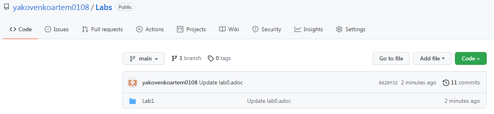
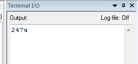
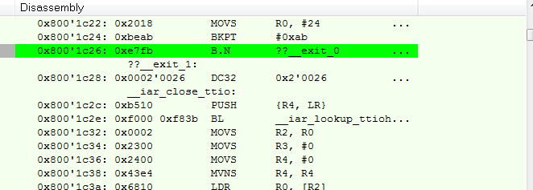
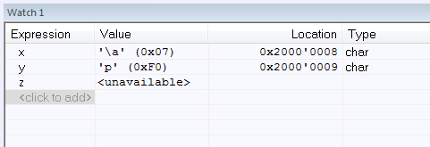
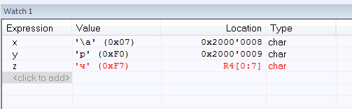
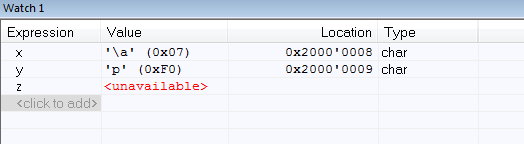
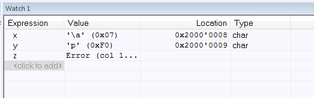
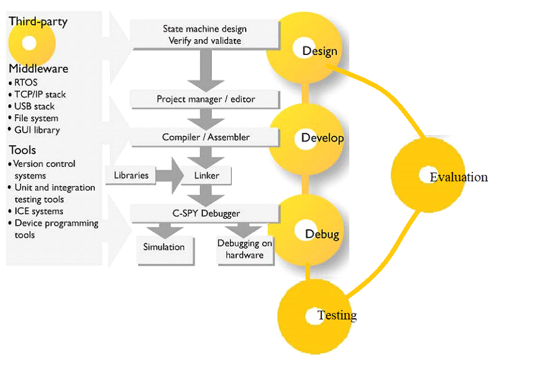

:figure-caption: Рисунок
= ОТЧЕТ по лабораторной работе № 1 

по дисциплине «Программное обеспечение измерительных процессов» +

Выполнил: студент группы КЭ-413 Яковенко А.Д. +

== *Задание*: +
   а) Создать в вашем github репозиторий Labs. +
   б) Создать в репозитории Labs папку Lab1. +
   в) Создать в папке Lab1 проект Lab1 С++ с main. +
   г) Сделать программу которая считает сумму двух char чисел, попробовать сложить несколько разных чисел, Вывести результат в Terminal I/O.  +   
   д) Запустить проект на выполнение по симулятором, посмотреть листинг дизамблера - попробовать определить где создались ваши переменные. +
   е) Проверить все переменные в окне watch, сделать пошаговую отладку (F10, F11), посмотреть, как меняются переменные в окне Watch. заупустить окно Resisters и посмотреть значения регистров в которых созданы переменные (если конечно они там созданы). +
   ё) Описать проделанную работу в отчете на asciidoc. +
   ж) Ответить на вопрос к первому разделу. +
   

 
.репозийторий Lab и папка Lab1 в репозийтории

Создадим проект Lab1 С++ и файл asciidoc +

.проект Lab1 С++ и asciidoc lab0.adoc
image::b.PNG[]

Сделаем программу которая считает сумму двух char чисел, попробовать сложить несколько разных чисел

.код программы
image::a1.PNG[]

.результат в Terminal I/O

char - символьный. Переменная типа char занимает 1 байт. Однако вместо конвертации значения типа char в целое число, оно интерпретируется как ASCII-символ. +
ASCII (сокр. от «American Standard Code for Information Interchange») — это американский стандартный код для обмена информацией, который определяет способ представления символов английского языка (+ несколько других) в виде чисел от 0 до 255. +

.окно Disassembly

.переменные в окне watch, с пошаговой отладкой

== *Ответы на вопросы*:

1.	Дайте определение понятию “Интегрированной среде разработки” +
*Ответ*: Интегрированная среда разработки, ИСP (англ. Integrated development environment — IDE), также единая среда разработки, ЕСР — комплекс программных средств, используемый программистами для разработки программного обеспечения (ПО). IDE (интегрированная среда разработки) — это не просто текстовый редактор. В то время как текстовые редакторы для кода, такие как Sublime или Atom, предлагают множество удобных функций, таких как подсветка синтаксиса, настраиваемый интерфейс и расширенные средства навигации, они позволяют только писать код. Для создания функционирующих приложений как минимум нужен компилятор и отладчик. +
2. Что такое компилятор и чем он отличается от транслятора? +

*Ответ*: Компилятор – это транслятор, который осуществляет перевод исходной программы в эквивалентную ей объектную программу на языке машинных команд или на языке ассемблера. Компилятор отличается от транслятора лишь тем, что его результирующая программа всегда должна быть написана на языке машинных кодов или на языке ассемблера. +

3 Что такое компоновщик и какие функции он выполняет? +

*Ответ*: Компоновку кода выполняет линковщик. Структурно процесс компоновки с помощью линковщика. На входе линковщика могут быть, внешние библиотеки, полученные на этапе трансляции в других проектах и программах, объектные файлы полученные на предыдущем этапе,стандартные(встроенные) библиотеки С++, и конфигурационный файл, описывающий настройки по размещению кода и данных в адресном пространстве микроконтроллера. Компоновщик создает исполняемый файл, который можно запустить на микроконтроллере +

.Схема процесса компоновки
image::g.png[400, 400]

4 Почему важен процесс проектирования ПО какие задачи входят в этот процесс? +

*Ответ*: Проектирование ведется поэтапно в соответствии со стадиями : Техническое задание; Техническое предложение; Эскизный проект; Технический проект; Рабочий проект.
На этапе проектирование можно заранее предусмотреть какие либо ошибки, которые могут долго устраняться на этапе реализации. +

5 Дорисуйте процесс разработки ПО, описанный на изображении Процесс разработки с точки зрения IAR Workbench с учетом итеративности связей в этом процессе +

*Ответ*: Процесс разработки программного обеспечения в общем случае ничем не отличается от процесса разработки приложения для обычных компьютеров, который включает в себя проектирование (Design), разработка кода(Develop), отладка(Debug) +

.Схема процесса разработки ПО

6 Зачем нужная отладка и в каких случаях она применяется? Для чего применяются точки остановки? +
*Ответ*: Отладкой - выявление и устранение причин неправильной рабо-ты программы. Необходимость проведения отладки возникает при обнаружении ошибок при тестировании. Отладку всегда придется проводить автору программы. Рекомендуют применять индуктивный и дедуктивный подходы к отладке. +
Если не удается найти причину неправильной работы то ставят точки остановки. С помощью них обычно указывается место, где произошла ошибка. Причиной чаще всего являются некорректные данные для этой операции и/или их отсутствие. При останове на этой точке просматривается значения участвующих в программе, и ищется ошибка. +

7 Какие еще важные IAR workbench можно добавить в таблицу [Характеристики IAR]

*Ответ*: 
возможность работы с многими микроконтроллерами большого числа производителей; +
возможность самостоятельного управления оптимизацией отдельных модулей проекта; +
постоянное добавление новых микроконтроллеров. 

