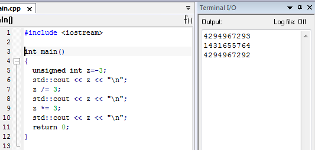

:figure-caption: Рисунок
= ОТЧЁТ по лабораторной работе №2 
:toc: 
:toc-title: Оглавление:

Яковенко А.Д. КЭ-413 +

=  *Задание* +

Написать программу вычисляющую следующее выражение -3/3U *3 ,удивиться увиденному и объяснить результат. +
Подключить плату к своему домашнему компу, проверить что все работает, плата прошивается и все работает как в аптеке. +
Запустить на плате Lab1 из https://github.com/lamer0k/stm32Labs/tree/master/Lab1 +
добавить main код для зажигания светодиодов

[source, c]
----
 RCC::AHB1ENR::GPIOAEN::Enable::Set() ;
  GPIOA::MODER::MODER5::Output::Set() ;
  GPIOA::ODR::ODR5::High::Set() ;
  Не забыть подключить
#include "gpioaregisters.hpp" //for Gpioa
----
Пронаблюдать, что произошло на плате, все сфоткать. +

= *Программа по выраженеию -3/3U *3*

Была создана программа, которая вычисляет следующее выражение: -3/3U *3 +

.Код программы
image::a1.PNG[]

Получилось -4, так как литтера U обозначает unsighned type, что и влияет на результат. +
Тип данных *unsigned int* - беззнаковое целое число. Тип unsigned int может хранить только положительные целые числа в диапазоне от 0 до 65535 (2^16)-1.

.Перевод в десятичный вид:

По стандарту С++ , если ты делишь знаковое на беззнаковое автоматом знаковое кастится к безнаковому. Тогда -3 в безнаковом десятичном виде представляет 11111111111111111111111111111101 = 4294967293. При делении 4294967293 на 3 получается 1431655764,3. Считаем без дробной части, так как нужно целое число(1431655764). 
Умножаем на 3, оно знаковое, результат умножение кастится к безнаковому 1431655764 *3 = 4 294 967 292 = 11111111111111111111111111111100, это есть -4 в дополнительном коде.

= *Проверка платы*

Подключаем плату; +
Настраиваем все в IAR, т.е. выбираем наше устройство. +

image::b.png[]
.Настройка платы
image::c.png[500, 500]

*Далее открываем проект и проверяем плату:*

[source, c]
----
 #include "rccregisters.hpp" // for RCC
 std::uint32_t SystemCoreClock = 16'000'000U;
 extern "C" {
int __low_level_init(void)
{
//Switch on external 16 MHz oscillator
RCC::CR::HSION::On::Set();
while (RCC::CR::HSIRDY::NotReady::IsSet())
{
  }
  //Switch system clock on external oscillator
  RCC::CFGR::SW::Hsi::Set();
  while (!RCC::CFGR::SWS::Hsi::IsSet())
  {
  }
  RCC::APB2ENR::SYSCFGEN::Enable::Set();
  return 1;
}
}
int main()
{
  return 0;
}
----

.Фото платы
image::d.png[]

= *Реализация зажигания диода на плате* 
 
[source, c]
----

 #include "rccregisters.hpp" // for RCC
 #include "gpioaregisters.hpp" //for Gpioa
 std::uint32_t SystemCoreClock = 16'000'000U;
 extern "C" {
int __low_level_init(void)
{
//Switch on external 16 MHz oscillator
 RCC::CR::HSION::On::Set();
while (RCC::CR::HSIRDY::NotReady::IsSet())
{
 }
//Switch system clock on external oscillator
RCC::CFGR::SW::Hsi::Set();
while (!RCC::CFGR::SWS::Hsi::IsSet())
{
 }
 RCC::APB2ENR::SYSCFGEN::Enable::Set();
 return 1;
 }
 }

 int main()
{
RCC::AHB1ENR::GPIOAEN::Enable::Set();
GPIOA::MODER::MODER5::Output::Set();
GPIOA::ODR::ODR5::High::Set();
 return 0;
}
----
*Результатом представлен на фото ниже:* +

.Фото платы
image::e.png[800, 800]

