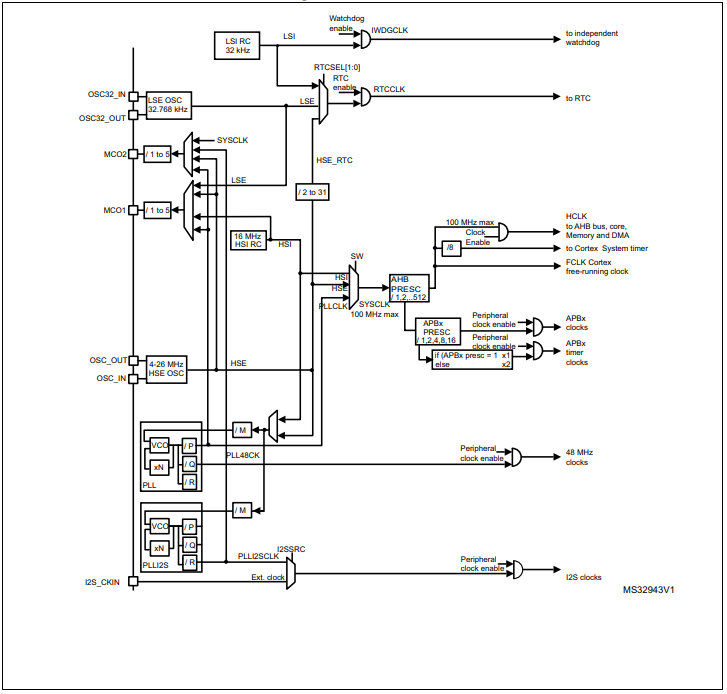

:figure-caption: Рисунок
:table-caption: Таблица
= Лабораторная работа №5
:toc:
:toc-title: Оглавление:

Яковенко А.Д. КЭ-413 +

=  *Задание* +

===  Написать программу, которая моргает всеми 4 светодиодами, но без использования GPIOA::ODR::ODR5::High::Set().

Все светодиоды загораются(A.5, C.5, C.8, C.9) после задержки все гаснут с частотой *30 МГц*. Тактирование системной частоты произвести с модуля PLL.

= *Введение*

=== XNUCLEO-F411RE 
*XNUCLEO-F411RE* – это отладочная плата от компании Waveshare с поддержкой Arduino, которая позволит изучить возможности микроконтроллера STM32F411RE на базе ядра Cortex-M3. +

.Взаимосвязь между светодиодом и выводами микроконтроллера
|===
| FLASH LED	 | MCU PIN 

|LED1
|D13(PA5/PB13)

|LED2
|PC9

|LED3
|PC8

|LED4
|PC5  
	
|===

Для задачи нужны выводы: PA_5; PC_9; PC_8; PC_5.

= *Система тактирования микроконтроллера STM32F411RE*

.Система тактирования

Для формирования системной тактовой частоты SYSCLK используют источники:

* *HSI* (high-speed internal) — высокочастотный внутренний RC генератор. Работает на частоте 16МГц.

* *HSE* (high-speed external) — высокочастотный внешний RC генератор. Работает на частоте 8МГц.

* *PLL* — система ФАПЧ. Набор из умножителей и делителей (PLLM, PLLN,PLLP), исходный сигнал он получает от HSI или HSE, а на выходе у него уже другая частота.

* LSI (low-speed internal) — низкочастотный внутренний RC-генератор на 37 кГц

* LSE (low-speed external) — низкочастотный внешний источник на 32,768 кГц

=== Настройка PLL
. Определить какие источники частоты нужны
. Включить нужный источник  (RCC::CR)
. Дождаться стабилизации источника 
. Назначить нужный источник на системную частоту (RCC::CFGR)
. Дождаться пока источник не переключиться на системную частоту 

=== Фазовая подстройка частоты PLL
Внутренний источник PLL тактируется от внешнего или внутреннего высокочастотных генераторов (HSE либо HSI). + 
С помощью регистров *PLLM* (от 2 до 63), *PLLN* (от 50 до 432), *PLLP* можно подобрать любую частоту (в нашем случае 30 МГц) до 100 МГц включительно по формуле: +
[source, c]
f = f(PLL clock input) × (PLLN / PLLM) /PLLP

По умолчанию на вход PLL поступает сигнал с HSI,  16 МГц и PLLP по умолчанию равеняется 2.

[source, c]
30 = 16 * (60 / 16) / 2

=== Регистр управления частотой
Clock Control register (CR) Как уже упоминалось, системная тактовая частота для серии "STM32F411" может быть до 100 МГц. Для ее формирования используются 3 основных источника — HSI, HSE, PLL. Включение и выключение основных генераторов производится через регистр RCC_CR — Clock Control register.

|===
| Bit 24 PLLON	 | Включить PLL. Этот бит устанавливается и скидывается программно, чтобы включить PLL. Бит не может быть скинут, если PLL уже используется как системная частота. 0:  PLL *OFF* 1: PLL *ON*
|===

Сразу после установки частоты, нужно проверить, что частота с нового источника стабилизировалась. Для этого используются те же поля того же регистра CR, оканчивающиеся на RDY (Ready)

|===
| Bit 25 PLLRDY	 |  Флаг готовности частоты PLL. Этот бит устанавливается аппаратно 0: PLL *unlocked* 1: PLL *locked*
| Bit 17: HSERDY | Флаг готовности частоты HSE. Этот бит устанавливается аппаратно. 0: HSE *oscillator not ready*  1: HSE *oscillator ready*
| Bit 1: HSIRDY	 | Флаг готовности частоты HSI. Этот бит устанавливается аппаратно 0: HSI *oscillator not ready*  1: HSI *oscillator ready*
|===
	
После включения генераторов частоты, необходимо выбрать один из них в качестве источника для системной частоты SYSCLK. Выбор осуществляется через регистр RCC_CFGR — Clock Configuration Register. 

|===
| Bits 1:0 SW	 | Выбор источника частоты. 00: HSI *scillator selected as system clock* 01: HSE *oscillator selected as system clock* 10: PLL *selected as system clock* 11: *not allowed*
|===

= *Код программы*

[source, c]
#include "gpioaregisters.hpp" //for GPIOA
#include "gpiocregisters.hpp" //for GPIOC
#include "rccregisters.hpp"   //for RCC
#include <iostream>
std::uint32_t SystemCoreClock = 16'000'000U;
extern "C" 
{
int __low_level_init(void)
{
  while (RCC::CR::HSIRDY::NotReady::IsSet());
  {
  }
  RCC::PLLCFGR::PLLN0::Set(60);
  RCC::PLLCFGR::PLLM0::Set(16);
  RCC::CR::PLLON::On::Set();
  while(RCC::CR::PLLRDY::NotReady::IsSet());
  {
  }
  RCC::CFGR::SW::Pll::Set();
  while(!RCC::CFGR::SWS::Pll::IsSet());
  {
  }
}
}
void delay(int cycles)
{
  for(int i=0; i < cycles; ++i)
  {
    asm volatile ("");
  }
}
int32_t* ptrPcOdr = reinterpret_cast<uint32_t*>(0x40020814);
uint32_t* ptrPaOdr = reinterpret_cast<uint32_t*>(0x40020014);
struct Leds
{
static void Blink()
{
  *ptrPcOdr ^=  static_cast<uint32_t> ((1 << 5) | (1 << 8) | (1 << 9));
  *ptrPaOdr ^=  static_cast<uint32_t>(1 << 5);
  delay(1000000);
  *ptrPcOdr ^=static_cast<uint32_t>((1 << 5) | (1 << 8) | (1 << 9));
  *ptrPaOdr ^=static_cast<uint32_t>(1 << 5);
  delay(1000000);
}
}
int main()
{
  RCC::AHB1ENR::GPIOAEN::Enable::Set();
  GPIOA::MODER::MODER5::Output::Set();
  RCC::AHB1ENR::GPIOCEN::Enable::Set();
  GPIOC::MODER::MODER5::Output::Set();
  GPIOC::MODER::MODER8::Output::Set();
  GPIOC::MODER::MODER9::Output::Set();
 for(;;)
 {
  Leds::Blink();
 }
}
int main()
{
  return 0;
}

При загрузке программы в микроконтроллер наблюдается мигание светодиода с более высокой частотой.

= *Результат*

.Результат программы
image::a.gif[300,300]

