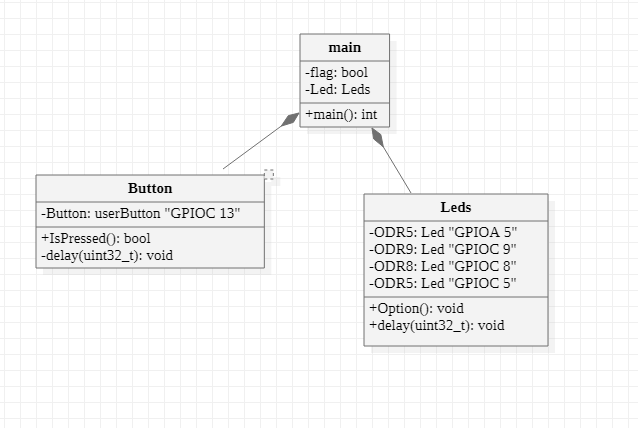

:figure-caption: Рисунок
:table-caption: Таблица
= Лабораторная работа №7
:toc:
:toc-title: Оглавление:

Яковенко А.Д. КЭ-413 +

=  *Задание* +

=== Сделать программу с использование ООП которая выполняет следющие действия. +
Сразу после запуска должны моргать все светодиоды с частотой 3.33 МГц. +
При нажатии на кнопку режим моргания изменяется на режим Елочки (Зажигаются поочередно первый, через 300 миллисекунд второй, через еще 300 миллисекунд третий и еще через 300 миллисекунду 4 светодиод), потом в обратном порядке гаснут
При следующем нажатии на кнопку  опять все светодиоды начинают моргать с частотой 3.33 МГц
При следующем - снова Елочка и т.д. +
 
=== Разрисовать архитектуру и дизайн ПО, а имеено классы, методы классов и взаимодействия классов в StarUML. +
По архитектуре написать и реализовать классы и потом и логику работы программы.

= *Введение*

=== XNUCLEO-F411RE 
*XNUCLEO-F411RE* – это отладочная плата от компании Waveshare с поддержкой Arduino, которая позволит изучить возможности микроконтроллера STM32F411RE на базе ядра Cortex-M3. +

.Взаимосвязь между светодиодом и выводами микроконтроллера
|===
| FLASH LED	 | MCU PIN 

|LED1
|D13(PA5/PB13)

|LED2
|PC9

|LED3
|PC8

|LED4
|PC5  
	
|===

Для задачи нужны выводы: PA_5; PC_9; PC_8; PC_5.

=== Push button
USER button. Кнопка пользователя подключается к I/O PC13(pin 2) целевого микроконтроллера, установив JP6 в положение ВКЛ.

=== Методология объектно-ориентированного программирования

Объектно-ориентированное программирование (ООП) - совокупность принципов, технологий, а также инструментальных средств для создания программных систем на основе архитектуры взаимодействия объектов. +

Основные принципы ООП: абстракция, наследование, инкапсуляция и полиморфизм.

* *Абстракция данных* - выделение значимой информации и исключение из рассмотрения незначимой. В ООП
рассматривают лишь абстракцию данных, подразумевая набор значимых характеристик объекта, доступный остальной программе (пример абстракция Человека, которая характеризуется только двумя параметрами Рост и Вес и цвет глаз).

* *Класс* представляет собой обетракцию совокупности реальных объектов, которые имеют общий набор свойста и обладают одинаковым поведением, Класс является описываемой на языке терминологии исходного кода моделью ещё не существующей сущности (объекта). Фактически он описывает устройство объекта, являясь своего рода чертежом.

* *Объект* в контексте ООП рассматривается как экземпляр соответствующего класса. (например, классом может являться
фрукт, а экземпляр класса фрукт - яблоко). 

* *Наследование* - свойство системы, позволяющее описать новый класс на основе уже существующего с частично или
полностью заимствующейся функциональностью. Класс, от которого производится наследование, называется базовым,
родительским или суперклассом. 

* *Инкапсуляция* - свойство системы, позволяющее объединить данные и методы, работающие с ними, в классе.

* *Полиморфизм* свойство системы, позволяющее использовать объекты с одинаковым интерфейсом без информации о типе и внутренней структуре объекта. Под полиморфизмом  понимается свойство объектов принимать различные внешние формы в зависимости от обстоятельств. 

= *Архитектура и взаимодействие классов в StarUML*

StarUML предоставляет максимальную степень адаптации среды разработки пользователя,
предлагая настройку параметров, которые могут влиять на методологию разработки программного
обеспечения, проектную платформу и язык.

.Схема в StarUML.

= *Регистр управления частотой*

Clock Control register (CR) Системная тактовая частота для серии "STM32F411" может быть до 100 МГц. Для ее формирования используются 3 основных источника — HSI, HSE, PLL. Включение и выключение основных генераторов производится через регистр *RCC_CR* — Clock Control register.

|===
| Bit 24 PLLON	 | Включить PLL. Этот бит устанавливается и скидывается программно, чтобы включить PLL. Бит не может быть скинут, если PLL уже используется как системная частота. 0:  PLL *OFF* 1: PLL *ON*
|===

Сразу после установки частоты, нужно проверить, что частота с нового источника стабилизировалась. Для этого используются те же поля того же регистра CR, оканчивающиеся на RDY (Ready)

|===
| Bit 25 PLLRDY	 |  Флаг готовности частоты PLL. Этот бит устанавливается аппаратно 0: PLL *unlocked* 1: PLL *locked*
| Bit 17: HSERDY | Флаг готовности частоты HSE. Этот бит устанавливается аппаратно. 0: HSE *oscillator not ready*  1: HSE *oscillator ready*
| Bit 1: HSIRDY	 | Флаг готовности частоты HSI. Этот бит устанавливается аппаратно 0: HSI *oscillator not ready*  1: HSI *oscillator ready*
|===
	
После включения генераторов частоты, необходимо выбрать один из них в качестве источника для системной частоты SYSCLK. Выбор осуществляется через регистр RCC_CFGR — Clock Configuration Register. 

|===
| Bits 1:0 SW	 | Выбор источника частоты. 00: HSI *scillator selected as system clock* 01: HSE *oscillator selected as system clock* 10: PLL *selected as system clock* 11: *not allowed*
|===

= *Регистры портов общего назначения* 

*GPIOx_MODER* (port mode register) Задает режимы работы индивидуально каждого из вывода порта. Каждый из выводов GPIO может быть настроен как вход, выход, работать в аналоговом режиме, или подключен к одной из альтернативных функций. 

|===
|MODERy[1:0]:	Биты конфигурации порта x (y=0..15)
Эти биты записываются программным обеспечением для настройки режима направления ввода-вывода. |*00*: Ввод (состояние сброса); *01*: Режим вывода общего назначения; *10*: Режим альтернативной функции; *11*: Аналоговый режим.
|===

*GPIOx_OSPEEDR* (port output speed register). Задает скорость работы порта: 400кГц, 2МГц, 10МГц и 40Мгц.
|===

|OSPEEDRy[1:0]:Биты конфигурации порта x (y=0..15)
Эти биты записываются программным обеспечением для настройки скорости вывода ввода-вывода.|*00*: Низкая скорость; *01*: Средняя скорость; *10*: Быстрая скорость; *11*: Высокая скорость  
	
|===

*GPIOx_IDR* (input data register). регистр входных данных, из которого считывается состояние входов порта. +
IDRy: Входные данные порта (y=0..15)
Эти биты доступны только для чтения и доступны только в режиме чтения. Они содержат входное значение соответствующего порта ввода-вывода.

*GPIOx_ODR* (output data register). регистр выходных данных. Запись числа в младшие 16 бит, приводит к появлению соответствующих уровней на выводах порта. +
ODRy: Выходные данные порта (y=0..15)
Эти биты могут быть прочитаны и записаны программным обеспечением. +
Примечание: Для набора/сброса атомарных битов биты ODR могут быть индивидуально установлены и сброшены путем записи
в регистр Gpioc_BSRR (x = A..E и H).

= *Код программы* 

=== Класс Button

[source, c]
#pragma once
#include "gpiocregisters.hpp"
class Button
{
//функция для защиты от дребезга кнопки
 void delay1 (uint32_t value)
{
for(uint32_t i = 0; i < value; ++i)
{
 asm volatile ("");
}
}
public:
bool IsPressed()
{
 bool result = false;
 if (GPIOC::IDR::IDR13::Low::IsSet())
  {
  delay1(1000000);
  result = true;
  }
 return result;
}
};

=== Класс Led

[source, c]
#pragma once
#include "gpiocregisters.hpp" //for GPIOC
#include "gpioaregisters.hpp" //for GPIOA
class Led
{
// функция задержки
public:
void delay (uint32_t value)
{
for(uint32_t i = 0; i < value; ++i)
{
asm volatile ("");
}
}
//функция первого режима "огонек"
public:
void Option1()
{
//задержка в 600600 обеспечивает частоту мигания в 3,33 Гц
   GPIOC::ODR::ODR5::High::Set() ;
   delay(600600);
   GPIOC::ODR::ODR8::High::Set() ;
   delay(600600);
   GPIOC::ODR::ODR9::High::Set() ;
   delay(600600);
   GPIOA::ODR::ODR5::High::Set() ;
   delay(600600);
   GPIOA::ODR::ODR5::Low::Set() ;
   delay(600600);
   GPIOC::ODR::ODR9::Low::Set() ;
   delay(600600);
   GPIOC::ODR::ODR8::Low::Set() ;
   delay(600600);
   GPIOC::ODR::ODR5::Low::Set() ;
   delay(600600);
}
//функция второго режима "мигание"
public:
void Option2()
{
   GPIOA::ODR::ODR5::High::Set() ;
   GPIOC::ODR::ODR5::High::Set() ;
   GPIOC::ODR::ODR8::High::Set() ;
   GPIOC::ODR::ODR9::High::Set() ;
   delay(600600);
   GPIOA::ODR::ODR5::Low::Set() ;
   GPIOC::ODR::ODR5::Low::Set() ;
   GPIOC::ODR::ODR8::Low::Set() ;
   GPIOC::ODR::ODR9::Low::Set() ;
   delay(600600);
}
};

=== Общий код программы

[source, c]
[source, c]
#include "gpioaregisters.hpp" //for GPIOC
#include "gpiocregisters.hpp" //for GPIOC
#include "rccregisters.hpp"   //for RCC
#include <iostream>
#include "Leed.h"
#include "Button.h"
std::uint32_t SystemCoreClock = 16'000'000U;
extern "C"
{
int __low_level_init(void)
  {
  //Switch on external 16 MHz oscillator
  RCC::CR::HSION::On::Set();
  while (RCC::CR::HSIRDY::NotReady::IsSet())
  {
  }
  //Switch system clock on external oscillator
  RCC::CFGR::SW::Hsi::Set();
  while (!RCC::CFGR::SWS::Hsi::IsSet())
  {
  }
  RCC::APB2ENR::SYSCFGEN::Enable::Set();
  RCC::AHB1ENR::GPIOAEN::Enable::Set();
  RCC::AHB1ENR::GPIOCEN::Enable::Set();
  GPIOA::OSPEEDR::OSPEEDR5::MediumSpeed::Set();
  GPIOA::MODER::MODER5::Output::Set();
  GPIOC::OSPEEDR::OSPEEDR13::MediumSpeed::Set();
  GPIOC::MODER::MODER13::Input::Set();
  GPIOC::OSPEEDR::OSPEEDR5::MediumSpeed::Set();
  GPIOC::MODER::MODER5::Output::Set();
  GPIOC::OSPEEDR::OSPEEDR8::MediumSpeed::Set();
  GPIOC::MODER::MODER8::Output::Set();
  GPIOC::OSPEEDR::OSPEEDR9::MediumSpeed::Set();
  GPIOC::MODER::MODER9::Output::Set();
  return 1;
 }
}
bool flag = false;
Led Leds;
Button userButton;
int main()
{
for (;;)
{
     if (flag == false)
      {
       Leds.Option2();
      }
      else
      {
       Leds.Option1();
      }
     if (userButton.IsPressed())
      {
         flag = !flag;
      }
   }
  return 1;
}

= *Результат программы* 

.Результат программы
image::a7.gif[300,300]

