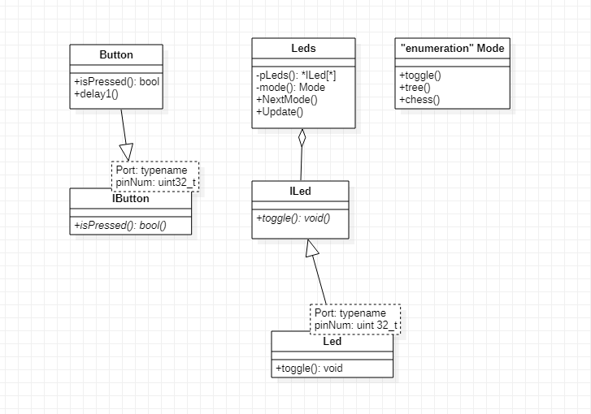

:figure-caption: Рисунок
:table-caption: Таблица
= Лабораторная работа №8
:toc:
:toc-title: Оглавление:

Чепульская , Яковенко КЭ-413 +

=  *Задание* +

=== Сделать программу с использование ООП которая выполняет следющие действия. +
Сразу после запуска должны моргать все светодиоды с частотой 3.33 Гц. 
При нажатии на кнопку(нажатие определяется по её прижатию) режим моргания изменяется на режим Елочки (Зажигаются поочередно первый, через 300 миллисекунд второй, через еще 300 миллисекунд третий и еще через 300 миллисекунду 4 светодиод), потом в обратном порядке гаснут
При следующем нажатии на кнопку  опять все светодиоды начинают моргать с частотой 3.33 Гц
При следующем - снова Елочка и т.д. +

Сделать тоже самое, что и в прошлый раз, но с архитектурой которую мы попытались сделать на прошлом уроке.

. Используя интерфейсы (абстрактный класс) для кнопки и светодиода
. Используя контейнер(контроллер) для светодиодов, который содержит в себе массив указателей на интерфейс из пункта 1.
. Контроллер светодиодов должен поддерживать 2 режима работы светодоиодов (моргают все светодиоды, и режим "елочка")
. Если успеете, нужно сделать еще и 3 режим, моргают четные и нечетный светодиоды в противофазе.
 
=== Разрисовать архитектуру и дизайн ПО, а имеено классы, методы классов и взаимодействия классов в StarUML. +
Можно сгенерировать заготовки классов прямо из программы. Можно сделать все самим
   По архитектуре написать и реализовать классы и потом и логику работы программы.
Все это должно быть в отчете.

= Методология объектно-ориентированного программирования

Объектно-ориентированное программирование (ООП) - совокупность принципов, технологий, а также инструментальных средств для создания программных систем на основе архитектуры взаимодействия объектов. +

Основные принципы ООП: абстракция, наследование, инкапсуляция и полиморфизм.

. *Абстракция данных* - выделение значимой информации и исключение из рассмотрения незначимой. В ООП
рассматривают лишь абстракцию данных, подразумевая набор значимых характеристик объекта, доступный остальной программе (пример абстракция Человека, которая характеризуется только двумя параметрами Рост и Вес и цвет глаз).

. *Класс* представляет собой обетракцию совокупности реальных объектов, которые имеют общий набор свойста и обладают одинаковым поведением, Класс является описываемой на языке терминологии исходного кода моделью ещё не существующей сущности (объекта). Фактически он описывает устройство объекта, являясь своего рода чертежом.

. *Объект* в контексте ООП рассматривается как экземпляр соответствующего класса. (например, классом может являться
фрукт, а экземпляр класса фрукт - яблоко).

. *Наследование* - свойство системы, позволяющее описать новый класс на основе уже существующего с частично или
полностью заимствующейся функциональностью. Класс, от которого производится наследование, называется базовым,
родительским или суперклассом.

= *Схема в StarUML*

Перед началом написания кода нам надо продумать архитектуру, которую мы будем воплащать. Для этого воспользуемся StarUML.

.Архитектура и взаимодействие классов в StarUML.

= *Код*

=== Виртуальные классы

Для начала создадим два виртаульных класса:

[source, c]
#pragma once
class IButton
{
   public:
   virtual bool IsPressed() = 0;
};

[source, c]
#pragma once
class ILed
{
   public:
   virtual void toggle() = 0;
};

Виртуа́льное насле́дование (англ. virtual inheritance) в языке программирования C++ — один из вариантов наследования, который нужен для решения некоторых проблем, порождаемых наличием возможности множественного наследования (особенно «ромбовидного наследования»), путём разрешения неоднозначности того, методы которого из суперклассов (непосредственных классов-предков) необходимо использовать. Оно применяется в тех случаях, когда множественное наследование вместо предполагаемой полной композиции свойств классов-предков приводит к ограничению доступных наследуемых свойств вследствие неоднозначности. Базовый класс, наследуемый множественно, определяется виртуальным с помощью ключевого слова virtual.

=== Класс Leed

Данный класс нужен для переопределения функции.

[source, c]
#pragma once
#include "gpiocregisters.hpp" //for GPIOC
#include "gpioaregisters.hpp"
#include "iLed.h" // for ILed
template<typename Port, uint32_t pinNum>
class Led : public ILed
{
public:
   void toggle() override
   {
      Port::ODR::Toggle(1U << pinNum);
   }
};

=== Класс leds

Этот класс нужен для основной реализации кода

[source, c]
#pragma once
#include "iLed.h"
#include "Leed.h"
#include "gpioaregisters.hpp" //for GPIOC
#include "gpiocregisters.hpp" //for GPIOC
template <auto* ...pArgs>
class Leds
{
public:
void NextMode()
 {
         if (mode == Mode::chess)
            {
               mode = static_cast<Mode>(static_cast<int32_t>(mode) - 3U);
            }
         mode = static_cast<Mode>(static_cast<int32_t>(mode) + 1U);
         SwitchOff();
 }
void update()
 {

   switch(mode)
    {
      case Mode::toggle:
      toggle();
      break;
      case Mode::tree:
      tree();
      break;
      case Mode::chess:
      chess();
      break;
    }
 }
    private:

      void toggle()
    {
      for(size_t i = 0; i < sizeof ...(pArgs); i++)
      {
        pLeds[i]->toggle();
      }
    }
     void tree()
    {
        pLeds[index]->toggle();
	     if (flagTree)
          index++;
	     else
	      index--;
         if(index == sizeof ...(pArgs))
            {
	            index = 3U;
                flagTree = false;
             }
	     if (index > sizeof ...(pArgs))
             {
               index = 0U;
               flagTree = true;
             }
    }
    void chess()
    {
      if (flagChess)
      {
        for(size_t i = index; i < sizeof ...(pArgs); i += 2)
          pLeds[i]->toggle();
	     flagChess = false;
      }
      else
      {
        for(size_t i = index; i < sizeof ...(pArgs); i += 2)
          pLeds[i]->toggle();
        if (!index)
          index = 1;
        else
          index = 0;
	     for(size_t i = index; i < sizeof ...(pArgs); i += 2)
          pLeds[i]->toggle();
      }
    }
    void SwitchOff()
    {
       GPIOA::ODR::ODR5::Low::Set() ;
       GPIOC::ODR::ODR5::Low::Set() ;
       GPIOC::ODR::ODR8::Low::Set() ;
       GPIOC::ODR::ODR9::Low::Set() ;
       index = 0U;
       flagChess = true;
       flagTree = true;
    }
      ILed* pLeds[sizeof ...(pArgs)] = {pArgs...};
      size_t index =0U;
      bool flagChess = true, flagTree = true;
     enum class Mode
     {
       toggle = 0,
       tree =1,
       chess = 2
     } mode;
};

=== Класс main

Итоговый вид программы:

[source, c]
#include "gpioaregisters.hpp" //for GPIOC
#include "gpiocregisters.hpp" //for GPIOC
#include "rccregisters.hpp"   //for RCC
#include <iostream>
#include "Leed.h"
#include "Button.h"
#include "iLed.h"
#include "leds.h"
std::uint32_t SystemCoreClock = 16'000'000U;
extern "C"
{
int __low_level_init(void)
{
//Switch on external 16 MHz oscillator
RCC::CR::HSION::On::Set();
while (RCC::CR::HSIRDY::NotReady::IsSet())
{
}
//Switch system clock on external oscillator
RCC::CFGR::SW::Hsi::Set();
while (!RCC::CFGR::SWS::Hsi::IsSet())
{
}
  RCC::APB2ENR::SYSCFGEN::Enable::Set();
  RCC::AHB1ENR::GPIOAEN::Enable::Set();
  RCC::AHB1ENR::GPIOCEN::Enable::Set();
  GPIOA::OSPEEDR::OSPEEDR5::MediumSpeed::Set();
  GPIOA::MODER::MODER5::Output::Set();
  GPIOC::OSPEEDR::OSPEEDR13::MediumSpeed::Set();
  GPIOC::MODER::MODER13::Input::Set();
  GPIOC::OSPEEDR::OSPEEDR5::MediumSpeed::Set();
  GPIOC::MODER::MODER5::Output::Set();
  GPIOC::OSPEEDR::OSPEEDR8::MediumSpeed::Set();
  GPIOC::MODER::MODER8::Output::Set();
  GPIOC::OSPEEDR::OSPEEDR9::MediumSpeed::Set();
  GPIOC::MODER::MODER9::Output::Set();
  return 1;
 }
}
void delay2 (uint32_t value)
{
   for(uint32_t i = 0; i < value; ++i)
   {
      asm volatile ("");
   }
}
Led<GPIOC, 5U> led1;
Led<GPIOC, 8U> led2;
Led<GPIOC, 9U> led3;
Led<GPIOA, 5U> led4;
Leds<&led1, &led2, &led3, &led4 >leds;
Button<GPIOC, 13U> userButton;
int main()
{
for (;;)
{
     if (userButton.IsPressed())
       {
         leds.NextMode();
       }
        leds.update();
        delay2(600600U);
   }
  return 1;
}

= *Результат* 

.Результат программы
image::VID_20211118_200435.gif[]

