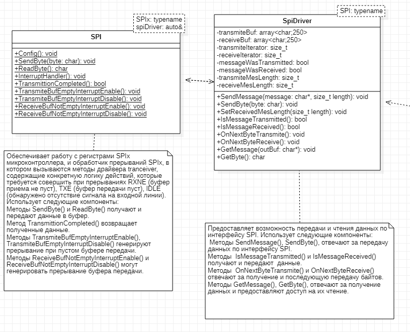
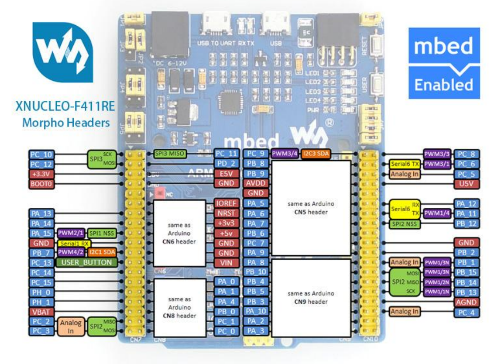
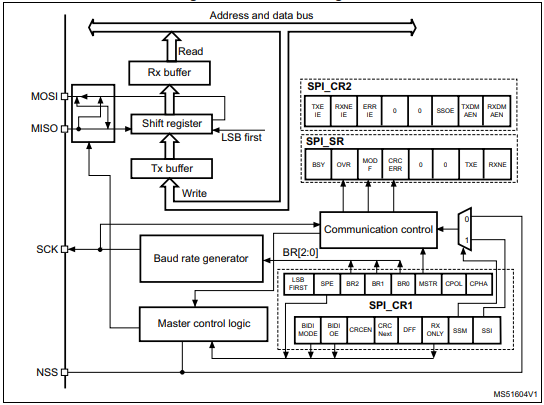

:figure-caption: Рисунок
:table-caption: Таблица
= Классы Spi и SpiDriver
:toc:
:toc-title: Оглавление:

Тема работы: *Разработка метеостанции с передачей параметров по беспроводному интерфейсу*

Чепульская О.С., Яковенко А.Д. КЭ-413 +

== Архетиктура классов

.Архитектура классов в StarUML.

== Общение с датчиком должно осуществляться по интерфейсу SPI

Последовательный периферийный интерфейс (SPI) обеспечивает полудуплексную/полнодуплексную синхронную последовательную связь с внешними устройствами. Интерфейс может быть сконфигурирован как ведущий, и в этом случае он обеспечивает синхронизацию связи (SCK) с внешним подчиненным устройством. + 
Интерфейс также способен работать в конфигурации multimaster. Он может использоваться для различных целей, включая симплексную синхронную передачу по двум линиям с возможной двунаправленной линией передачи данных или надежную связь с использованием проверки CRC. +
Интерфейс SPI имеет два режима: 4-проводной и 3-проводной. Протокол одинаков для обоих.

Интерфейс SPI:

|===
|Function pin | STM32 interface | Describe

| VCC		
| 3.3V /5V
| Входная мощность 3.3V

| GND		
| GND
| Земля

| MOSI
| PA7		
| SPI data input

| SCK
| PA5		
| SPI clock input

| MISO
| PA6		
| SPI data output

| CS	
| PB6
| Выбор чипа SPI, активный при низком напряжении

|===

Обычно SPI подключается к внешним устройствам через четыре контакта:

* MISO: Master In / Slave Out data. 
* MOSI: Master Out / Slave In data. 
* SCK: Serial Clock output for SPI masters and input for SPI slaves. (Последовательный тактовый выход для ведущих SPI и вход для ведомых SPI.)
* NSS: Slave select. This is an optional pin to select a slave device. (Выбор ведомого устройства, позволяя ведущему SPI взаимодействовать с подчиненными устройствами индивидуально и избегать конфликтов в линиях передачи данных.)

.Структурная схема SPI

Контакты MOSI и контакты MISO соединены вместе. Таким образом, данные передаются последовательно между ведущим и ведомым (сначала самый значимый бит).

Общение всегда инициируется мастером. Когда ведущее устройство передает данные на подчиненное устройство через вывод MOSI, подчиненное устройство отвечает через вывод MISO. Это подразумевает полнодуплексную связь как с выводом данных, так и с вводом данных, синхронизированных с одним и тем же тактовым сигналом (который обеспечивается главным устройством через вывод SCK).

*Методы SendByte() и ReadByte()* получают и передают данные в буфер.
Регистр данных разделен на 2 буфера - один для записи (буфер передачи) и другой для чтения (буфер приема). Запись в регистр данных приведет к записи в буфер Tx, а считывание из регистра данных вернет значение, хранящееся в буфере Rx.

*Методы TransmiteBufEmptyInterruptEnable(), TransmiteBufEmptyInterruptDisable()* отвечают за включение прерывания с пустым буфером Tx.

*Методы ReceiveBufNotEmptyInterruptEnable() и ReceiveBufNotEmptyInterruptDisable()* отвечают за разрешение прерывания при заполнении буфера RX.

*Метод TransmittionCompleted()* отвечает за завершение передачи данных, проверяет происходит ли передача данных и пуст ли Tx буфер.

*Метод SpiInterruptHandler* обрабатывает прерывания буфера Rx и Tx и перенаправляет их в методы OnNextByte.

*Методы SendMessage(), SendByte()* отвечают за передачу данных по интерфейсу SPI.

*Методы  IsMessageTransmitted() и IsMessageReceived()* получают и передают  данные.

*Методы  OnNextByteTransmite() и OnNextByteReceive()* отвечают за получение и последующую передачу байтов.

*Методы GetMessage(), GetByte()* отвечают за получение данных и предоставляют доступ на их чтение.

*Метод SetReceivedMesLength* устанавливает длину полученного сообщения. 

== Код программы

SPI

[source, cpp]
#pragma once
#include "spi2registers.hpp"
#include "spi1registers.hpp"
#include <gpiocregisters.hpp>
#include <gpiobregisters.hpp>
struct SpiConfig
{
  SpiConfig();
};
template<typename SPIx, auto& transceiver>
class SPI
{
  static SpiConfig config; 
public:
  using T=char;
  static void Config(SpiConfig config);  
  static void SendByte(T byte)
  {    
    SPIx::DR::Write(byte);    
  }
  static T ReadByte()
  {
    return SPIx::DR::Get();
  }  
  static void TransmiteBufEmptyInterruptEnable()
  {
    SPIx::CR2::TXEIE::NotMasked::Set();
  }   
  static void TransmiteBufEmptyInterruptDisable()
  {
    SPIx::CR2::TXEIE::Masked::Set();
  }  
  static void ReceiveBufNotEmptyInterruptEnable()
  {
    SPIx::CR2::RXNEIE::NotMasked::Set();
  }  
    static void ReceiveBufNotEmptyInterruptDisable()
  {
    SPIx::CR2::RXNEIE::Masked::Set();
  }  
  static bool TransmittionCompleted()
  {
    return SPIx::SR::BSY::NotBusy::IsSet();
  } 
  static void SpiInterruptHandler()
  {
    if(SPIx::CR2::RXNEIE::NotMasked::IsSet()&&SPIx::SR::RXNE::RxBufferNotEmpty::IsSet())
    {
       transceiver.OnNextByteReceive();
    }
    if (SPIx::CR2::TXEIE::NotMasked::IsSet()&&SPIx::SR::TXE::TxBufferEmpty::IsSet())
    {
      transceiver.OnNextByteTransmite();
    }
  }
};

SpiConfig

[source, cpp]
#pragma once
#include "spiDriver.h"
#include "spi.h"
class spi1;
inline SpiDriver<spi1> spi1Transceiver;
class spi1 : public  SPI<SPI1, spi1Transceiver> {};
class spi2;
inline SpiDriverOnlyTransmit<spi2> spi2Transceiver;
class spi2 : public  SPI<SPI2,spi2Transceiver> {};

SpiDriver

[source, cpp]
#pragma once
#include "spi.h"
template<typename spi>
class SpiDriver
{
  std::array<char,200> transmiteBuf ={0};
  std::array<char,200> receiveBuf = {0};
  uint32_t transmiteMessLength=1;
  uint32_t receiveMessLength=1;
  bool messageWasReceived=false;
  bool messageWasTransmited=false;
  uint32_t Rit=0;
  uint32_t Tit=0;
public:
  void SendMessage(char* message, std::size_t size)
  {
    messageWasTransmited=false;   
    uint32_t L=size;
    if(transmiteBuf.size()<L) L=transmiteBuf.size();
    transmiteMessLength=L;
    std::memcpy(transmiteBuf.data(), message,transmiteMessLength);
    messageWasReceived=(receiveMessLength==0);    
    if(receiveMessLength!=0)
    {
      spi::ReadByte();
      spi::ReceiveBufNotEmptyInterruptEnable();
    }
    spi::TransmiteBufEmptyInterruptEnable();   
  }
  void SendByte(char byte)
  {
    messageWasTransmited=false;   
    transmiteMessLength=1;
    transmiteBuf[0]=byte;
    messageWasReceived=(receiveMessLength==0);
    spi::ReadByte();
    if(receiveMessLength!=0)
    {
      spi::ReadByte();
      spi::ReceiveBufNotEmptyInterruptEnable();
    }
    spi::TransmiteBufEmptyInterruptEnable();   
  } 
  void OnNextByteTransmite()
  {
    if(Tit<transmiteMessLength||(!messageWasReceived))
    {
      if(Tit>=transmiteMessLength)
      {
        transmiteBuf[Tit]=transmiteBuf[Tit-1];
      }
      spi::SendByte(transmiteBuf[Tit++]);
    }
    else
    {
      Tit=0;
      spi::TransmiteBufEmptyInterruptDisable();
      if(receiveMessLength==0)
      {
        while(!spi::TransmittionCompleted())
        {
        }
      }
      messageWasTransmited=true;
    }
  }
  void OnNextByteReceive()
  {
    static bool isfirst=true;
    uint8_t bf=spi::ReadByte();
    if(!messageWasReceived)
    {
      if(!isfirst)
      {
        receiveBuf[Rit++]=bf;
        if(Rit==receiveMessLength)
        {         
          spi::ReceiveBufNotEmptyInterruptDisable();
          Rit=0;
          messageWasReceived=true;
          isfirst=true;
        }
      }
      else
      {
        isfirst=false;
      }
    }
  }
  bool IsMessageReceived()
  {
    return messageWasReceived;
  }
  bool IsMessageTransmited()
  {
    return messageWasTransmited;
  }
  void GetMessage(char* outBuf)
  {
    std::memcpy(outBuf, receiveBuf.data(),receiveMessLength);
    //receiveBuf.fill(0);
    messageWasReceived=false;
  }
  char GetByte()
  {
    messageWasReceived=false;
    char bf = receiveBuf[0];
    receiveBuf[0]=0;
    return bf;
  } 
  void SetReceivedMesLength(std::size_t size)
  {
    receiveMessLength=size;
  }
};

