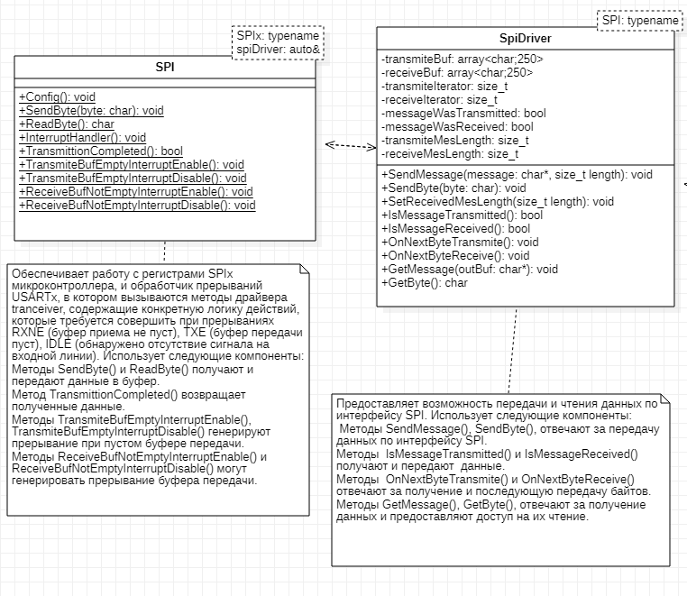

= Классы Spi и SpiDriver
:toc:
:toc-title: Оглавление:

Тема работы: *Разработка метеостанции с передачей параметров по беспроводному интерфейсу*

Чепульская О.С., Яковенко А.Д. КЭ-413 +

== Архетиктура классов

.Архитектура классов в StarUML.

== Общение с датчиком должно осуществляться по интерфейсу SPIx (где х - любой не равный 1,2,3)

Последовательный периферийный интерфейс (SPI) обеспечивает полудуплексную/полнодуплексную синхронную последовательную связь с внешними устройствами. Интерфейс может быть сконфигурирован как ведущий, и в этом случае он обеспечивает синхронизацию связи (SCK) с внешним подчиненным устройством. + 
Интерфейс также способен работать в конфигурации multimaster. Он может использоваться для различных целей, включая симплексную синхронную передачу по двум линиям с возможной двунаправленной линией передачи данных или надежную связь с использованием проверки CRC. +
Интерфейс SPI имеет два режима: 4-проводной и 3-проводной. Протокол одинаков для обоих.

Интерфейс SPI:

|===
|Function pin | STM32 interface | Describe

| VCC		
| 3.3V /5V
| Входная мощность 3.3V

| GND		
| GND
| Земля

| MOSI
| PA7		
| SPI data input

| SCK
| PA5		
| SPI clock input

| MISO
| PA6		
| SPI data output

| CS	
| PB6
| Выбор чипа SPI, активный при низком напряжении

|===

Обычно SPI подключается к внешним устройствам через четыре контакта:

* MISO: Master In / Slave Out data. 
* MOSI: Master Out / Slave In data. 
* SCK: Serial Clock output for SPI masters and input for SPI slaves. (Последовательный тактовый выход для ведущих SPI и вход для ведомых SPI.)
* NSS: Slave select. This is an optional pin to select a slave device. (Выбор ведомого устройства, позволяя ведущему SPI взаимодействовать с подчиненными устройствами индивидуально и избегать конфликтов в линиях передачи данных.)

image::kr12.png[600, 600]

.Структурная схема SPI
image::kr11.png[]

Контакты MOSI и контакты MISO соединены вместе. Таким образом, данные передаются последовательно между ведущим и ведомым (сначала самый значимый бит).

Общение всегда инициируется мастером. Когда ведущее устройство передает данные на подчиненное устройство через вывод MOSI, подчиненное устройство отвечает через вывод MISO. Это подразумевает полнодуплексную связь как с выводом данных, так и с вводом данных, синхронизированных с одним и тем же тактовым сигналом (который обеспечивается главным устройством через вывод SCK).

*Управление выводами Slave select (NSS)*

Управление выбором аппаратного или программного подчиненного устройства можно настроить с помощью бита SSM в регистре SPI_CR1.

* Программное обеспечение для управления NSS (SSM = 1)

Информация о выборе ведомого устройства управляется внутренне значением бита SSI в регистре SPI_CR1. Внешний контакт NSS остается свободным для использования в других приложениях.

* Аппаратное управление NSS (SSM = 0)

Возможны две конфигурации в зависимости от конфигурации вывода NSS (бит SSOE в регистре SPI_CR2). +
– Выход NSS включен (SSM = 0, SSOE = 1) +
Эта конфигурация используется только тогда, когда устройство работает в главном режиме. Сигнал NSS становится низким, когда ведущий начинает связь, и остается низким до тех пор, пока SPI не будет отключен. +
– Выход NSS отключен (SSM = 0, SSOE = 0) +
Для устройств, настроенных как подчиненные, вывод NSS действует как классический вход NSS: подчиненный выбирается, когда NSS низкий, и отменяется, когда NSS высокий.

*Настройка SPI в подчиненном режиме*

В конфигурации ведомого устройства последовательные тактовые сигналы поступают на вывод SCK от ведущего устройства. Значение, установленное в битах BR[2:0] в регистре SPI_CR1, не влияет на скорость передачи данных.

Процедура: +
1) Установите бит DFF для определения 8- или 16-разрядного формата фрейма данных +

image::kr13.png[]

2) Выберите биты CPOL и CPHA, чтобы определить одно из четырех соотношений между передачей данных и последовательным тактовым сигналом. Для правильной передачи данных биты CPOL и CPHA должны быть настроены одинаково на подчиненном устройстве и главном устройстве. +

image::kr14.png[]

3) Формат кадра (MSB-first или LSB-first в зависимости от значения бита LSBFIRST в регистре SPI_CR1) должен совпадать с форматом главного устройства. +

image::kr15.png[]

4) В аппаратном режиме вывод NSS должен быть подключается к сигналу низкого уровня во время полной последовательности передачи байтов. В программном режиме NSS установите бит SSM и очистите бит SSI в регистре SPI_CR1. +

image::kr16.png[]

5) Установите бит RF в регистре SPI_CR2, чтобы выбрать протокол режима TI для последовательной связи (можно использовать для настройки последовательной связи). +

image::kr17.png[]

6) Очистите бит MSTR и установите бит SPE (оба в регистре SPI_CR1), чтобы назначить контакты альтернативным функциям. +
В этой конфигурации вывод MOSI является вводом данных, а вывод MISO - выводом данных.

image::kr18.png[400, 400]

*Настройка SPI в главном режиме*

В основной конфигурации последовательный тактовый сигнал генерируется на выводе SCK.

Процедура: +
1) Установите бит DFF для определения 8- или 16-разрядного формата фрейма данных +

image::kr13.png[]

2) Выберите биты CPOL и CPHA, чтобы определить одно из четырех соотношений между передачей данных и последовательным тактовым сигналом. Для правильной передачи данных биты CPOL и CPHA должны быть настроены одинаково на подчиненном устройстве и главном устройстве. +

image::kr14.png[]

3) Формат кадра (MSB-first или LSB-first в зависимости от значения бита LSBFIRST в регистре SPI_CR1) должен совпадать с форматом главного устройства. +

image::kr15.png[]

4) В аппаратном режиме вывод NSS должен быть подключен к сигналу низкого уровня во время полной последовательности передачи байтов. В программном режиме NSS установите бит SSM и очистите бит SSI в регистре SPI_CR1. +

image::kr16.png[]

5) Установите бит RF в регистре SPI_CR2, чтобы выбрать протокол режима TI для последовательной связи. +

image::kr17.png[]

6) Очистите бит MSTR и установите бит SPE (оба в регистре SPI_CR1), чтобы назначить контакты альтернативным функциям. +
В этой конфигурации вывод MOSI является вводом данных, а вывод MISO - выводом данных.

image::kr18.png[400, 400]

*Настройка SPI для полудуплексной связи SPI способен работать в полудуплексном режиме в 2 конфигурациях.*

* 1 тактовый и 1 двунаправленный провод передачи данных
* 1 тактовая частота и 1 провод передачи данных (только для приема или только для передачи)

1 тактовая частота и 1 двунаправленный провод передачи данных (BIDIMODE = 1)
Этот режим включается путем установки бита BIDIMODE в регистре SPI_CR1. 

image::kr19.png[ ]

В этом режиме SCK используется для синхронизации, а MOSI в главном или MISO в подчиненном режиме используется для передачи данных связь. Направление передачи (ввод/вывод) выбирается битом BIDIOE в регистре SPI_CR1. Когда этот бит равен 1, строка данных выводится, в противном случае она вводится.

image::kr20.png[]

1 тактовая частота и 1 однонаправленный провод передачи данных (BIDIMODE = 0)
В этом режиме приложение может использовать SPI либо в режиме только передачи, либо в режиме только приема.

* Режим только передачи аналогичен полнодуплексному режиму (BIDIMODE= 0, RXONLY =0): данные передаются на вывод передачи (MOSI в главном режиме или MISO в подчиненном режиме), а вывод приема (MISO в главном режиме или MOSI в подчиненном режиме) может использоваться в качестве ввод-вывод общего назначения. 

image::kr21.png[]

* В режиме только для приема приложение может отключить функцию вывода SPI, установив бит RXONLY в регистре SPI_CR1. В этом случае он освобождает вывод ввода-вывода передачи (MOSI в режим master или MISO в режиме slave), поэтому его можно использовать для других целей.

*Отключение SPI*

Когда передача завершается, приложение может остановить связь, отключив периферийное устройство SPI. Это делается путем очистки бита SPE. +
Для некоторых конфигураций отключение SPI и переход в режим остановки во время выполнения передачи могут привести к повреждению текущей передачи и/или флаг BSY может стать ненадежным. +
Чтобы избежать любого из этих эффектов, рекомендуется соблюдать следующую процедуру при отключении SPI: +
В ведущем или ведомом полнодуплексном режиме (BIDIMODE=0, RXONLY=0) +
1. Подождите, пока RXNE=1, чтобы получить последние данные +
2. Подождите, пока TXE=1 +
3. Затем подождите, пока BSY=0 +
4. Отключите SPI (SPE=0) и, в конечном итоге, войдите в режим остановки (или отключите периферийные часы). +
В ведущем или ведомом режиме только однонаправленной передачи (BIDIMODE=0, RXONLY=0) или в режиме двунаправленной передачи (BIDIMODE=1, BIDIOE=1) После записи последних данных в регистр SPI_DR: +
1. Подождите, пока TXE=1 +
2. Затем подождите, пока BSY=0 +
3. Отключите SPI (SPE=0) и, в конечном итоге, войдите в режим остановки (или отключите периферийные часы).

Подводя итог, на основе официальной библиотеки, основной процесс получения данных BME280 для различных платформ выглядит следующим образом: + 
*Шаг 1:* Инициализация системы и периферийных устройств. +
*Шаг 2:* Реализуйте функции чтения SPI, записи SPI, задержки на разных платформах, назначьте указатель функции переменной-члену структуры bme280_dev и передайте указатель структуры для инициализации и после этого можно инициализировать устройство BME280. +
*Шаг 3:* Вызов функции int8_t stream_sensor_data_forced_mode(struct bme280_dev *dev) или функции int8_t stream_sensor_data_normal_mode(struct bme280_dev *dev), получая данные датчика BME280 и выводит их на главный компьютер или консоль. +

